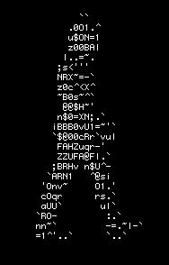

# Hi, I'm Madu — An Android Developer & Software Engineer.

I build at the intersection of **technical rigor** and **aesthetic precision**. 
Currently focused on crafting seamless, high-performance native experiences within the **Android ecosystem**.

- 🔭 I’m currently freelancing.
- 🌱 And happily learning JetPack Comnpose.

---

### 🛠 Professional Profile
* **Engineering:** Specialized in **Kotlin** and **Jetpack Compose**, moving from the world of critical industrial interfaces (SCADA) to the fluid world of mobile architecture (**MVVM / Clean Architecture**).
* **Philosophy:** I believe code should be as robust as it is beautiful. My background in Software Engineering ensures a foundation of performance, while my eye for design ensures a premium user experience.

### 🎨 Creative Soul

Beyond the IDE, I am deeply immersed in the visual and sonic arts:
* **Digital Art & UI:** Passionate about minimalist interfaces and the harmony of digital composition.
* **Sonic Focus:** I code and create to the resonance of **432Hz BGM**, seeking frequency-alignment in both my life and my workflow.
* **Vision:** Merging the logic of an engineer with the intuition of a designer.

---

### 🌌 Tech Stack
`Kotlin` • `Jetpack Compose` • `Material Design` • `Figma` • `Git`

[Let's connect](www.linkedin.com/in/devmaduoliveira) 

